# Übung - 04: Raspberry Pi and IoT Analytics

# Goal of the lab

This exercise is splitted into two parts:

1. Setting up a Raspberry Pi
1. Getting Event Hub and Stream Analytics job running on Azure


---
# Task 1: Setup a Raspberry Pi #

Lets setup a Raspberry Pi. For this follow the instructions you can find [here](https://github.com/raspberrypi/noobs/blob/master/README.md)

Prerequsits:
- RPi
- SD Card (minimum 8GB)
- External screen
- External keyboard
- Mouse
- Internet connectivity

Finally, when you are done with setting it up and you are also done with task 2, try to run the python scripts on the RPi.

Now, we are ready to to send data to the cloud for further analytics.

---
# Task 2: Analyzing Data in Real Time with Azure Stream Analytics #

[Azure Stream Analytics](https://azure.microsoft.com/services/stream-analytics/) is a cloud-based service for ingesting high-velocity data streaming from devices, sensors, applications, Web sites, and other data sources and analyzing that data in real time. It supports a [SQL-like query language](https://msdn.microsoft.com/library/azure/dn834998.aspx) that works over dynamic data streams and makes analyzing constantly changing data no more difficult than performing queries on static data stored in traditional databases. With Azure Stream Analytics, you can set up jobs that analyze incoming data for anomalies or information of interest and record the results, present notifications on dashboards, or even fire off alerts to mobile devices. And all of it can be done at low cost and with a minimum of effort.

Scenarios for the application of real-time data analytics are legion and include fraud detection, identity-theft protection, optimizing the allocation of resources (think of an Uber-like transportation service that sends drivers to areas of increasing demand *before* that demand peaks), click-stream analysis on Web sites, shopping suggestions on retail-sales sites, and countless others. Having the ability to process data *as it comes in* rather than waiting until after it has been aggregated offers a competitive advantage to businesses that are agile enough to make adjustments on the fly.

## Exercise 1: Create an event hub ##

Azure Stream Analytics supports several types of input, including input from Azure blobs and input from Azure event hubs. Of the two, the latter is typically more interesting because in the IoT world, data is easily transmitted to Azure event hubs through field gateways (for devices that are not IP-capable) or cloud gateways (for devices that *are* IP-capable), and a single Azure event hub can handle millions of events per second transmitted from devices spread throughout the world.

In this exercise, you'll create an Azure event hub to provide input to Azure Stream Analytics and configure it to so that it can be accessed safely and securely by IoT devices and gateways. 

1. In your browser, navigate to the [Azure Portal](https://portal.azure.com). If you are asked to sign in, do so using your Microsoft account.

1. In the portal, click **+ Create a resource**, followed by **Event Hubs**.

    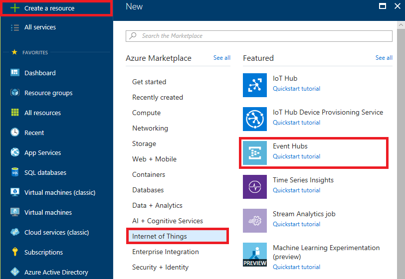

    _Adding a new event hub_

1. Type a namespace name into the **Name** box. The name must be unique within Azure, so you will probably have to use something other than the name in the screen shot below. (A green check mark will appear in the box when the name you've entered is one that Azure will accept.) Select **Create new** under **Resource group** and select your resource-group. Choose as region "West Europe" in the **Location** drop-down, and then click the **Create** button.

    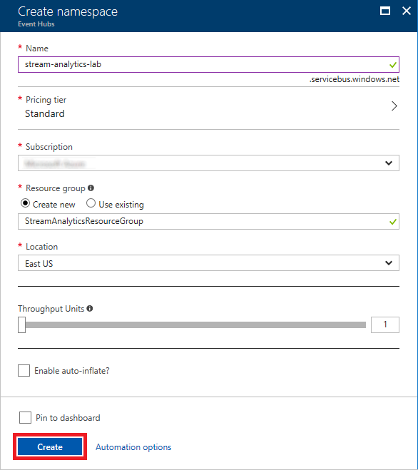

    _Creating a namespace_

1. Click **Resource groups** in the ribbon on the left, and then select your resource group created in the previous step.

    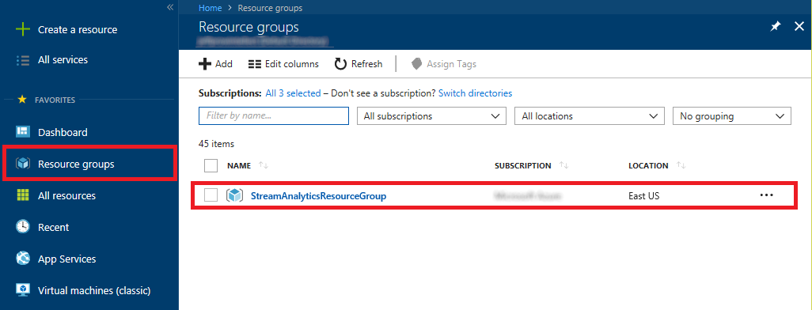

    _Opening the resource group_

1. Wait until "Deploying" changes to "Succeeded." (You can click the **Refresh** button at the top of the blade to refresh the deployment status.) Then click the namespace whose name you specified in Step 3.

    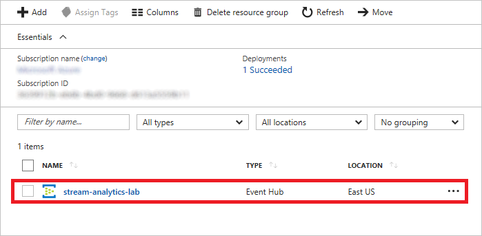

    _Opening the namespace_

1. Click **+ Event Hub** to add an event hub to the namespace.

    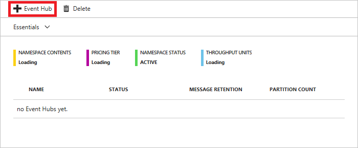

    _Adding an event hub_

1. Type "inputhub" (without quotation marks) into the **Name** box. Then click the **Create** button.

    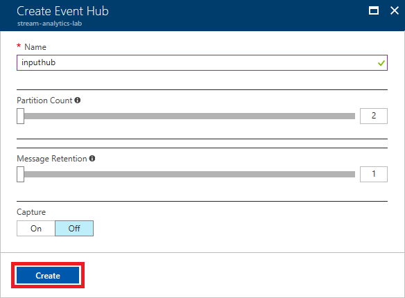

    _Creating an event hub_

1. Wait a moment for the event hub to be created. Then scroll to the bottom of the blade and click the event hub name.

    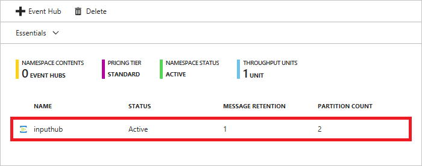

    _Opening the event hub_

1. In order to transmit events to the event hub from an application or device, you need to create a shared-access policy that includes Send permission. To begin, click **Shared access policies**, and then click **+ Add**.

    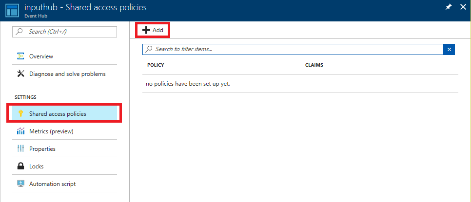

    _Adding a shared-access policy_

1. Type "SendPolicy" (without quotation marks) into the **Policy name** box and check the **Send** box. Then click the **Create** button to create the new policy.

    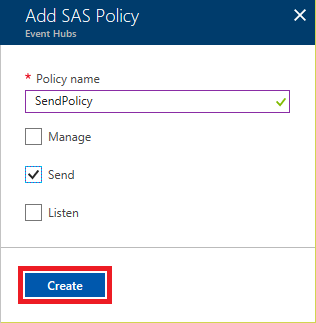

    _Creating a send policy_

1. Wait a moment for **SendPolicy** to appear in the policies list, and then click it.

    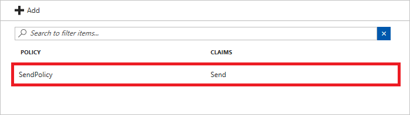

    _Opening the policy_

1. Click the **Copy** button to the right of the **Primary key** box to copy the policy's shared-access key to the clipboard. Then temporarily save the key by pasting it into your favorite text editor. You'll need it in the next exercise.

    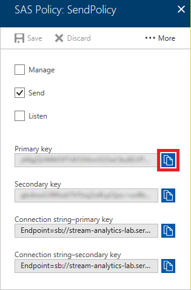

    _Copying the primary key to the clipboard_

You have created an event hub that can ingest events and be used as the source of input to a Stream Analytics job. You have also created a policy that allows holders of that policy to send events to the event hub. The next step is to generate a security token that can be used to authenticate calls to the event hub.

## Exercise 2: Send events to the event hub ##

Applications, devices, or gateways can send events to event hubs using the [Azure Event Hubs REST API](https://msdn.microsoft.com/en-us/library/azure/Dn790674.aspx). Each request transmitted via this API must include a valid [shared-access signature (SAS)](https://azure.microsoft.com/en-us/documentation/articles/service-bus-shared-access-signature-authentication/) token in the HTTP Authorization header. SAS tokens are generated from the event hub's URL and the primary key for the policy used to communicate with the event hub — in this case, the policy named "SendPolicy" that you created in the previous exercise.

You need the following prerequisites:

   - Python 3.4 or later.


To install the Python package for Event Hubs, open a command prompt that has Python in its path, and then run this command:

     pip install azure-eventhub

    
To send events use the send.py file in this repo and replace 

- ADDRESS = "http://<hub-name goes here>.servicebus.windows.net/<replace-with-your-hub>"
- KEY = "<replace me *******KjB/kixRINvHTau5*******=>"

with your event hub URL and the primary key for the **RootManageSharedAccessKey** poliy in your event hub.


At the command prompt or in a terminal window, navigate to the directory containing the send.py file. Then execute the following command:

	```
	python send.py
	```

	You should see output similar to the following. Each line represents one event sent to the event hub, and events will probably roll by at a rate of about 2 to 3 per second. (Rates will vary depending on your connection speed.) **Confirm that each request returns the HTTP status code 201**. This indicates that the event hub received and accepted the request. If you receive any other status code — for example, 401 — then the SAS token probably isn't valid and you need to repeat [Exercise 2](#Exercise2).

	```
    Sending message: {'Id': '76', 'Temp': '23'}
    Sending message: {'Id': '77', 'Temp': '24'}
    Sending message: {'Id': '78', 'Temp': '24'}
    Sending message: {'Id': '79', 'Temp': '20'}
    Sending message: {'Id': '80', 'Temp': '24'}
    Sending message: {'Id': '81', 'Temp': '24'}
    Sending message: {'Id': '82', 'Temp': '25'}
    Sending message: {'Id': '83', 'Temp': '25'}
    Sending message: {'Id': '84', 'Temp': '21'}
    Sending message: {'Id': '85', 'Temp': '23'}
	```

Now that events are flowing to your event hub, the next step is to create a Stream Analytics job and connect it to the event hub.

## Exercise 3: Create a Stream Analytics job ##

In this exercise, you will use the Azure Portal to create a Stream Analytics job and connect it to the event hub you created in [Exercise 1](#Exercise1). You will also capture the raw data being passed to the Stream Analytics job from the event hub and examine its structure.

1. Return to the [Azure Portal](https://portal.azure.com) and click **+ Create a resource**, followed by **Stream Analytics job**.

    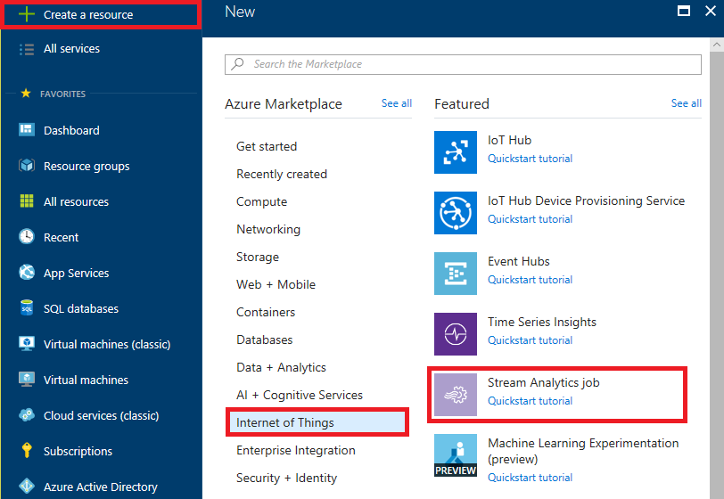

    _Creating a Stream Analytics job_

1. Type "<yourInitials>Analytics" (without quotation marks) into the **Job name** box. Select **Use Existing** under **Resource group** and select the **your** resource group. Select the region "West Europe". Then click the **Create** button.

    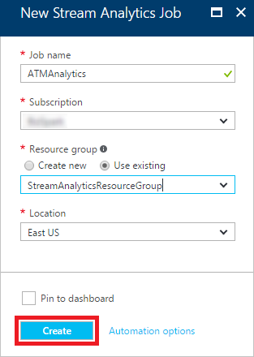

    _Specifying parameters for the Stream Analytics job_

1. Click **Resource groups** in the ribbon on the left, and then click the "StreamAnalyticsResourceGroup" resource group.

    

    _Opening the resource group_

1. Click **ATMAnalytics** to open the Stream Analytics job in the portal.

    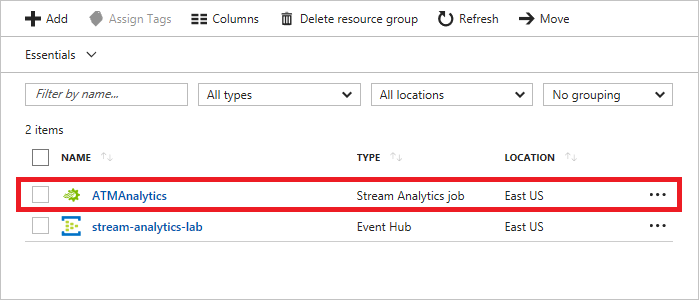

    _Opening the Stream Analytics job_

1. Click **Inputs** to add an input to the Stream Analytics job.

    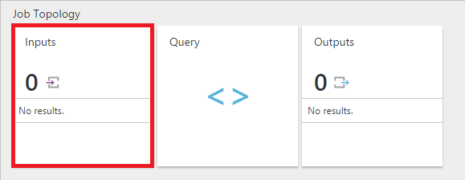

    _Adding an input_

1. Click **+ Add**.

    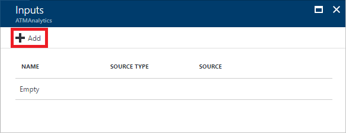

    _Adding an input_

1. Type "Datain" (without quotation marks) into the **Input alias** box. Make sure **Source Type** is set to **Data stream** and **Source** is set to **Event hub**. Select the service-bus namespace and event hub ("inputhub") you created in [Exercise 1](#Exercise1). Then select **RootManageSharedAccessKey** from the **Event hub policy name** drop-down and click the **Create** button at the bottom of the blade.

    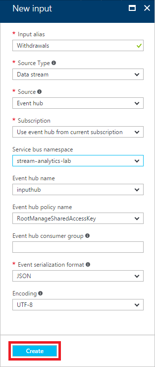

    _Creating an input_

1. After a few moments, the new input — "Withdrawals" — appears in the list of inputs for the Stream Analytics job. Click it to open a blade for it.

    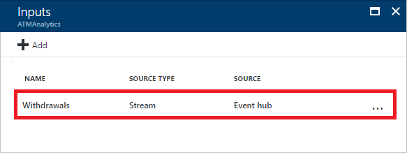

    _Opening the input_

1. Go back to the Command Prompt or terminal window you left open at the end of the previous exercise and run eventgen.js again by executing the following command:

	```
	node eventgen.js
	```

1. With eventgen.js still running, return to the Azure Portal open in your browser and click **Sample Data**.

	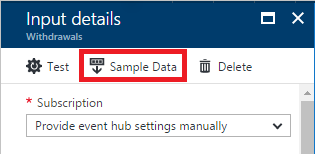

	_Sampling input data_

1. Click **OK** to begin sampling data from the input stream.

	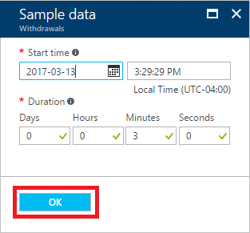

	_Specifying sampling parameters_

1. Wait a few seconds for sampling to complete, and when you are notified that the sample data can be downloaded, click to download it.

	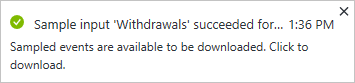

	_Data sampling completed_

1. Click **Download** to download the data sampled from the input stream.

	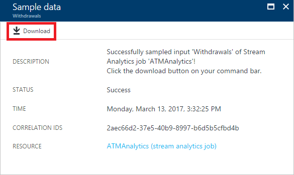

	_Downloading sample data_

1. Save the JSON file that is downloaded to a location where you can easily find it. Then open the downloaded file in your favorite text editor and take a moment to examine its contents. How many rows (events) are represented in the sample data? What is the structure of each row — that is, what fields does each row contain?


You have connected a Stream Analytics job to an event hub and demonstrated that data is passed from one to the other. You have also sampled the data input to the Stream Analytics job and examined its structure. The next step is to do something with it — specifically, to bring the power of Azure Stream Analytics to bear on the data.  

## Exercise 4: Prepare queries and test with sample data ##

Now that your job is set up, there's much more you can do with Stream Analytics than simply view the raw data presented to it. The whole point of Stream Analytics is being able to query real-time data streams. In this exercise, you will use the [Stream Analytics Query Language](https://msdn.microsoft.com/en-us/library/azure/Dn834998.aspx) to query a sample data set for potentially fraudulent ATM transactions. It is always a good idea to test your queries against sample data before deploying them against live data streams, because with sample data, you can verify that a known set of inputs produces the expected outputs.

To flag potentially fraudulent withdrawals from ATMs, you will query for transactions performed with the same ATM card at different ATM machines within a specified time window (60 seconds). In real life, you would probably use a larger time window and perhaps even factor in the distance between ATM machines. However, a narrower time window is useful in a lab environment because it allows you to perform meaningful experiments in minutes rather than hours.

1. Begin by returning to the Stream Analytics job in the portal and clicking **Query**.

    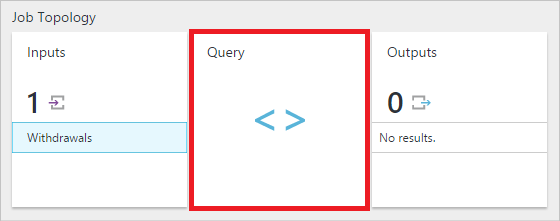

    _Opening the query viewer_

1. Click the **ellipsis** (the three dots) to the right of **Datain** and select **Upload sample data from file** from the menu.

    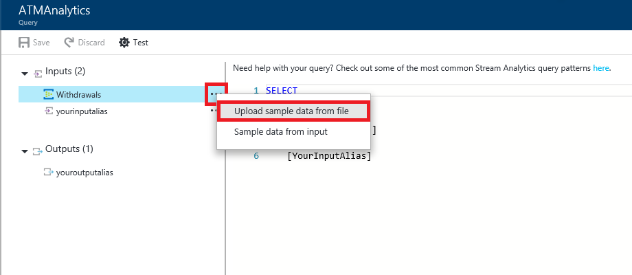

    _Uploading sample data for testing queries_

1. Click the **folder** icon on the right and select the file named **Datain.json** from the lab resources. Then click **OK** to upload the file.

	> The reason you're using a file provided for you (rather than the one you captured in the previous exercise) is to make sure everyone gets the same results. eventgen.js uses JavaScript's Math.random() function to randomize results, and Math.random() does not produce repeatable sequences of pseudo-random numbers.

    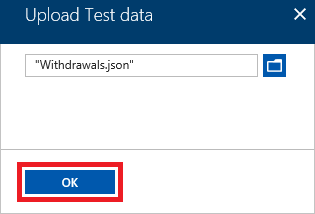

    _Uploading Withdrawals.json_

1. When the upload is complete, enter the following query, and then click the **Test** button to execute it against the sample data you uploaded:

	```sql
	SELECT * FROM Datain
	```

1. Suppose you only wanted to view transactions for amounts between 200 and 300, inclusive. Furthermore, suppose you wanted to clean up the output by assigning your own column names and excluding the TRANSACTIONID column. Enter the following query and click **Test** again to execute it.

	```sql
	SELECT Id as [ID],
	       Temp as [Temperature],
	FROM Datain
	WHERE Temperature >= 22 and Temperature <= 24
	```

1. Click the **Save** button at the top of the blade to save the query. Then click **Yes** when asked to confirm.

    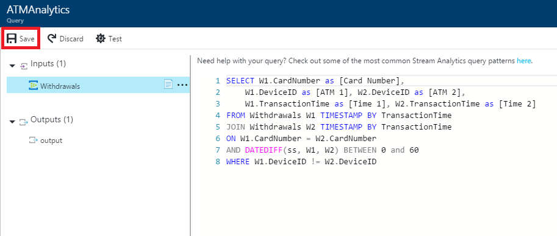

    _Saving the query_


## Exercise 5: Analyze a live data stream ##

Being able to run your queries and see the results in the portal is great for testing, but when Azure Stream Analytics is deployed against a live data stream, you need to specify a destination (or destinations) for the output. Stream Analytics supports a variety of output types, including blobs, Azure SQL databases, and even event hubs. One motivation for using blob storage is to create a persistent record from the output.

In this exercise, you will create a storage account and configure the Stream Analytics job to store output in blob storage. Then you will run the job against a live data stream and check the results by inspecting blob storage.

1. Return to the Azure Portal and click **+ Create a resource** in the ribbon on the left. Then click **Storage**, followed by **Storage account**.

    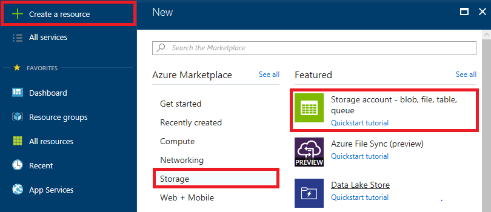

    _Adding a storage account_

1. In the ensuing blade, enter a unique name for the new storage account and make sure a green check mark appears next to it. Select **Use existing** under **Resource group** and select **your** resource group so the storage account will belong to the same resource group as the Stream Analytics job and the event hub. Select the same **Location** you selected in previous exercises. Then click the **Create** button at the bottom of the blade.

1. Click **Outputs**.

    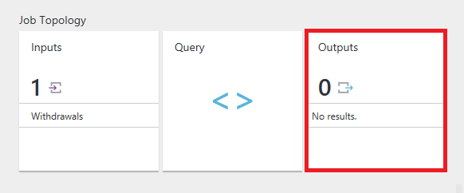

    _Adding an output_

1. Click **+ Add**.

    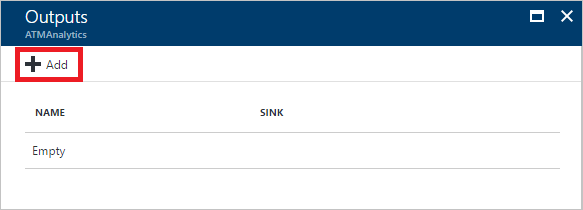

    _Adding an output_

1.  Type "Dataout" (without quotation marks) into the **Output alias** box. Set **Sink** to **Blob storage** and **Subscription** to **Use blob storage from current subscription**. Under **Storage account**, select the storage account you created earlier in this exercise. Set **Container** to **Create a new container** and type "output" (without quotation marks) into the second **Container** box. Type "{date}" (without quotation marks) into the **Path pattern** box, and set **Date format** to **DD-MM-YYYY**. Then click **Create**.

	> Each time you run a Stream Analytics job configured with a blob output, a new blob with a unique name is created. The purpose of **Path pattern** is to allow you to organize output blobs by date and time. In this example, the "output" container will contain folders whose names are the dates of the runs, and each folder will contain blobs with the output from those runs. 

    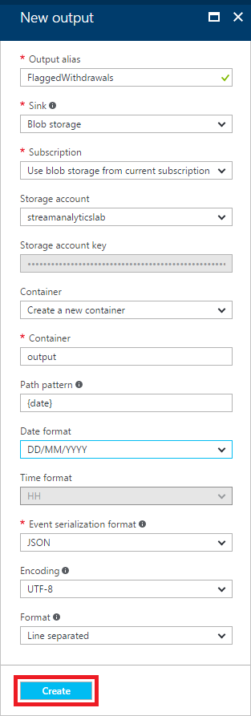

    _Creating an output_

1. Close the "Outputs" blade and return to the blade for the Stream Analytics job. Then click **Start**.

    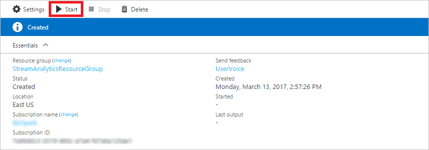

    _Starting the Stream Analytics job_

1. Make sure **Job output start time** is set to **Now**, and then click the **Start** button to start running the job.

    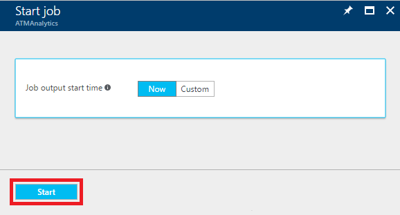

    _Specifying the job start time_

1. Return to the Command Prompt or terminal window in which you ran eventgen.js and execute the following command to run it again:

	```
	python send.py
	```

1. Click **Blobs**.

    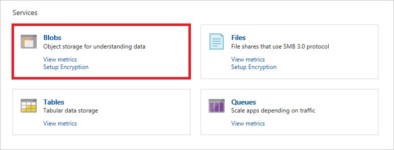

    _Opening blob storage_

1. Click the container named "output."

    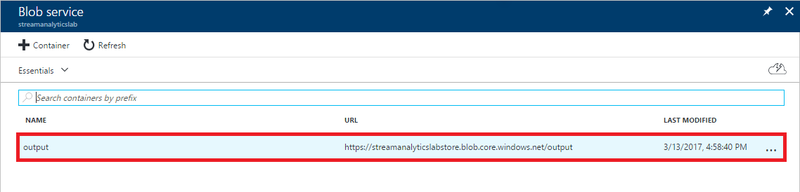

    _Opening the output container_

1. Click the folder in the "output" container.

    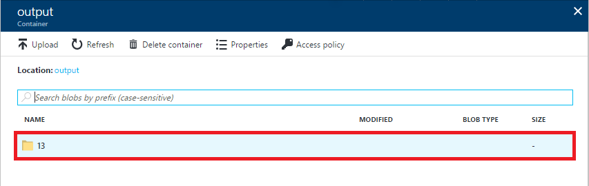

    _Opening the output folder_

1. Click the blob containing the Stream Analytics output.

	> If there is no output blob, wait a few minutes and check again. Sometimes a blob created by a Stream Analytics job appears immediately, and at other times, it may take a few minutes to show up.

	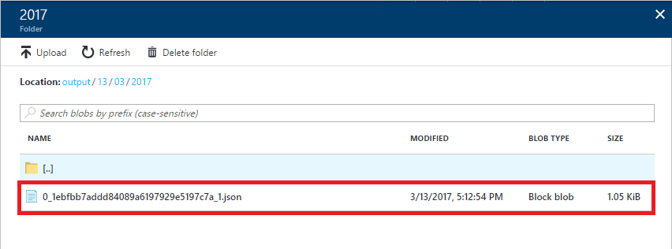

    _Opening the output blob_

1. Click **Download** to download the blob.

    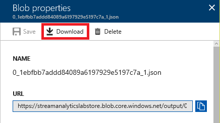

    _Downloading the output blob_

1. Open the downloaded JSON file in your favorite text editor. Each object (row) in the output represents a potentially fraudulent transaction. Note that **the number of rows and the content of each row will vary from machine to machine as well as from one run to another**.

Currently, the output from your Stream Analytics job is stored in blobs. In real life, you might prefer to view the output in a more convenient form, such as in a chart that's updated in real time. You could accomplish that by writing an application that monitors the blob and charts the data, or, better yet, by directing the output to an event hub and writing an application that subscribes to events from the event hub.

Microsoft recognizes that not everyone wants to write applications, and has provided an alternative in the form of [Microsoft Power BI](https://powerbi.microsoft.com/). With Power BI, you can create dashboards that render output from Stream Analytics jobs without writing any code. For more information, refer to [Stream Analytics & Power BI: A real-time analytics dashboard for streaming data](https://azure.microsoft.com/en-us/documentation/articles/stream-analytics-power-bi-dashboard/).

